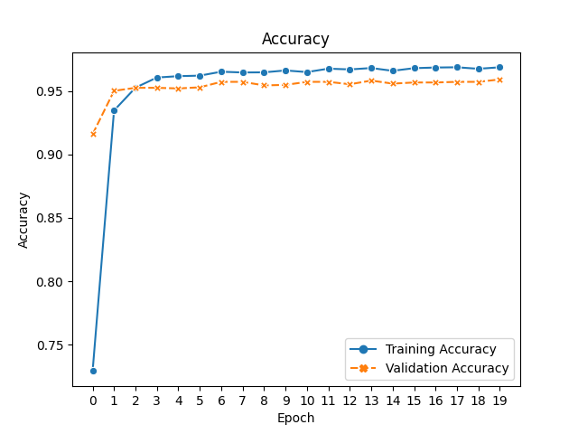

<!-- PROJECT LOGO -->
 

  <h1 align="center">Embedding Learning and Clustering in Packed Scenes</h1>

  

    Learning an embedding for similar-looking objects in packed scenes. Using the embedding to cluster detected objects.
Visualizing the congregations. The training dataset is slightly corrupted with class duplication and mixture.
     
  

## Built With

* PyTorch
* NumPy
* Scikit-image
* Scikit-learn
* hdbscan
* Pandas
* Matplotlib
* Seaborn
* Pillow
* Jupyter notebook

## Technical Details

### 1. Overview

The task can be considered as object re-identification, which requires an effective discrimination of objects in the
same category. Detected objects are classified into sub-categories, of which the total number is usually large but
instances of each are scarce. Besides, sub-categories are not guaranteed to reoccur in testing domain.

  Challenge: clustering and congregation

Therefore, an embedding instead of a traditional classifier is often learnt to be transferred. It can be trained
implicitly inside a normal classifier, or explicitly through metric learning. The latter drives instances of the same
sub-category closer and different ones more distant, under a chosen metric (distance or similarity). The most common
metric learning is trained with pairwise or triplet loss, by directly comparing instances.

In this report, the combination of these approaches is investigated: an explicit metric (cosine similarity in this
implementation) is computed, and in the meantime guided by classification for faster convergence. Traditional
classification-fashioned embedding learning is used as baseline to show the gain.

### 2. Classification-guided Similarity Metric Learning

Instead of treating a fully connected layer as a simple classifier, its parameters (size of embedding dimensions by
class number) can be interpreted as anchor embeddings for all the sub-categories in the training set. Its product with
input embeddings is then cosine similarities (before normalization) of the input instance and cluster centers.

After embedding and anchor vector normalization, the entry of a traditional multi-class classifier becomes cosine
similarities. Classification losses like Cross Entropy Loss affect explicitly on the similarities as well as anchors,
rendering the sub-categories as clusters with clear boundaries on the manifold. Explicit anchors as cluster centers
memorize the learning history, which accelerates significantly the convergence, compared to common Siamese-like metric
learning (according to my PhD research).

A coefficient λ on the similarities is introduced to control the compactness of clusters. It defines the maximum
magnitude of Cross Entropy entries, and hence the loss has a lower bound higher than 0. A smaller λ results in more
separate clusters but might reduce the ability of generalization of the model.

Metric other than cosine similarity can also be employed via simple modification on the implementation. The impact of
its choosing should be an interesting research topic.

 

  Training statistics

### 3. Clustering in Testing Phase

Like most embedding learning, the head (including the training anchors) is discarded. The truncated backbone projects
test instances onto the embedding hypersphere where a clustering based on cosine similarity happens.

In this challenge, clustering has many difficulties: unknown cluster number, occlusions, cluster size imbalance, very
small clusters (2 instances or even singletons), etc. A hierarchical clustering method is first applied to cover
probable clusters, followed by a second one with a minimal sample size (thus 2) for retrieval from noises.

With the clustering result, detections are aggregated according to their spatial distribution. Morphological
transformations like Closing are used to bridge small gaps and form connected components for each cluster.

  

  Features maps of random training data

 

  Visualization of clusters of training data

### 4. Result and Discussion

Analysis on learnt embedding and clustering result shows an agreeable effectiveness of the proposed method. Improvement
over baseline classification-style implicit embedding learning can be observed on the aggregation results, though the
baseline is already acceptable.

 

  Aggregation result

Mistakes are made on both training and testing set. In my opinion, it is mainly due to intentional manipulations of the
training data. Sabotages like class duplication and mixture make the model slightly confused. Besides, since the
fabricated classes are usually tiny, a weighted classifier or input sampler for class balance fall straightly into the
trap.

The neural network architecture is as simple as the first two layers of AlexNet with few filters (therefore not
pretrained). For comparison, fine-tuning on the last layer (and the last two layers as well) of the original 5-layer
pretrained model has been investigated. The poorer performance should come from an overfitting by much greater
parameters.

Input images are normalized with ImageNet pixelwise mean and standard deviation. It might not be suitable for the
challenge. Besides, illumination adaptation or adjustment could be helpful in future improvements. Data enhancements
like Random Erasing would bring amelioration against occlusions. Resizing the original images results in information
loss of object shape and size. This issue should also be addressed in the future.

<!-- CONTACT -->

## Contact

Bonan Cuan - bonan dot cuan arobase gmail dot com

